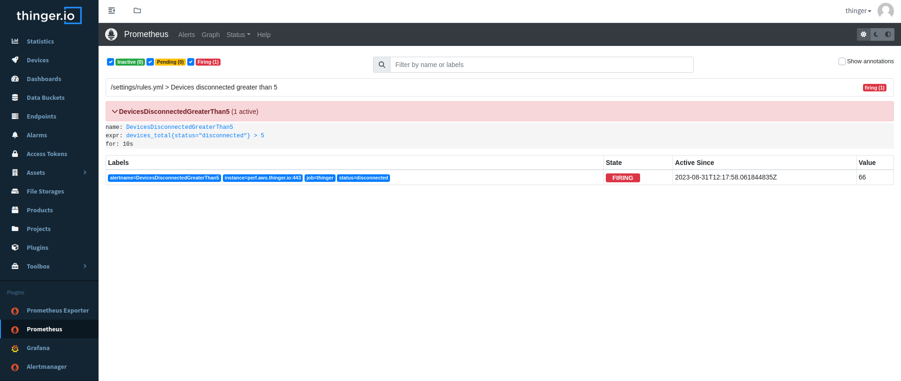

# Alertmanager

  

The Alertmanager handles alerts sent by clients applications such as Prometheus server. More information in their [official documentation](https://prometheus.io/docs/alerting/latest/alertmanager/).

## Get Started

This plugins requires the existence of the [Prometheus plugin](https://marketplace.thinger.io/plugins/prometheus), as it will create a new file storage called 'Prometheus Settings'. This file storage contains a template of the configuration in order to scrape the [Prometheus Exporter Plugin](https://marketplace.thinger.io/plugins/prometheus-exporter) endpoint. The installation of the Alertmanager plugin will add the `alertmanager.yml` configuration file as well as an example alert rule for Prometheus.

In order for the connection to take place, edit the `prometheus.yml` file by introducing your details and selecting your desired configuration.

## Official Documentation

The Prometheus documentation offers extensive information on how to configure the alertmanger in case you require further details on what is provided by default.

You can find how to configure Alermanager at [this link](https://prometheus.io/docs/alerting/latest/configuration/) and how to create alerting rules [here](https://prometheus.io/docs/prometheus/latest/configuration/alerting_rules/).

More details regarding the configuration of Prometheus at [this link](https://prometheus.io/docs/prometheus/latest/configuration/configuration/).

> [!NOTE]
> Any configuration change in `prometheus.yml` or `rules.yml` requires a
> restart of the Prometheus plugin, and any change to `alertmanager.yml`
> requires a restart of the Alertmanager plugin.
