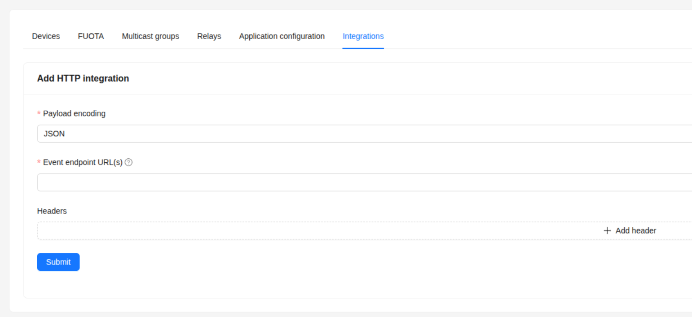

# ChirpStack 

  

ChirpStack is a flexible, open-source LoRaWAN® Network Server that allows organisations to deploy and operate their own private or public IoT networks with full control over infrastructure and data. It is widely used by companies, research institutions, and communities looking for reliable large-scale LoRaWAN deployments without vendor lock-in.

With Thinger.io, ChirpStack users can easily extend their networks by adding powerful tools for storing, analysing, and visualising device data in real time. This integration helps transform raw LoRaWAN traffic into actionable insights, dashboards, and long-term records.

The plugin bridges ChirpStack with Thinger.io through the **Products** feature, enabling automatic device and bucket provisioning, as well as flexible uplink and downlink processing pipelines that can be fully customised to the needs of each project.

---

## Getting Started

> **Prerequisite**  
> Devices within the selected ChirpStack Application must be **homogeneous**—same type and model—so that autoprovision can assign the correct product template.

1. **Install the plugin** inside your Thinger.io account.  
   See the guide [**“How to install a plugin”**](https://marketplace.thinger.io/plugins/managing/) on the Marketplace if you are not familiar with the process.

---

## Plugin Configuration

Open the plugin settings page. In the **Applications** table click **Add +** and fill in:

| Field                | Description                                                                                                                                                                     |
| -------------------- | ------------------------------------------------------------------------------------------------------------------------------------------------------------------------------- |
| **Application Name** | Must match **exactly** the Application ID defined in ChirpStack. The plugin uses this value to correctly associate uplinks and downlinks with the right application.            |
| **Device ID Prefix** | Prefix used when generating the device identifier; the Device EUI is appended automatically. Required for autoprovision of devices in Thinger.io.                               |
| **Access Token**     | API token generated in ChirpStack to allow secure communication with the Network Server. This is required to authenticate all requests.                                         |
| **Server URL**       | The base URL of your ChirpStack instance. Since ChirpStack is self-hosted, you must provide the public or private endpoint where your server is running.                        |
| **Port**             | The gRPC service port exposed by ChirpStack (default is `8080`). If you are running ChirpStack behind a reverse proxy, make sure this port is accessible or properly forwarded. |
| **Enabled**          | Toggles the application integration on or off.                                                                                                                                  |

Unlike TTN or LORIOT, ChirpStack must be deployed and managed by the user. The plugin backend communicates with ChirpStack using gRPC (HTTP/2), which provides efficient and real-time interaction but also requires that the gRPC service port is reachable by Thinger.io.

In most cases, you will need to either:

- Expose the correct gRPC port on your ChirpStack instance, or

- Configure your reverse proxy (e.g., Nginx, Traefik, etc.) to support HTTP/2 + grpc_pass.

Since ChirpStack is self-hosted, network accessibility is critical. In our tests we verified connectivity by forwarding the gRPC port from the router directly to the ChirpStack server, ensuring uplinks and downlinks were processed correctly.

## ChirpStack Webhook Configuration

Log in to the ChirpStack Application Server and select the target Application.

Navigate to Integrations → Add Integration and choose the generic HTTP integration (since there is no specific Thinger.io template available yet).

Complete the form with the values provided by the Thinger.io plugin:

| Field                     | Value                                                                                                                                                                               |
| ------------------------- | ----------------------------------------------------------------------------------------------------------------------------------------------------------------------------------- |
| **Event endpoint URL(s)** | Copy the value shown in the plugin under **Endpoint Base URL for Uplinks**. ChirpStack will send all application traffic (uplinks, join events, acknowledgements) to this endpoint. |
| **Headers**               | Add a new header with key **Authorization** and value equal to the **ChirpStack API Token** provided in the plugin settings page.                                                   |

After saving, uplink traffic will start appearing in the plugin Logs panel.
At this point the devices may still be unrecognised; autoprovision occurs once a matching Device Template is installed or created.

More details on HTTP integrations can be found in the [ChirpStack documentation](https://www.chirpstack.io/docs/).

---

## Device Templates

Device templates define:

* The expected data structure for an specific thinger product
* Uplink / downlink processing scripts  
* Default dashboards, device properties and data buckets

### Install a Device Template

Search the Marketplace for a template that matches your device model. If none exists, you can [create your own template](https://docs.thinger.io/products). Notice that, in Thinger.io, a **Product** is a template that defines the structure and behaviour of a device and can also be installed as a plugin.

> **Important**  
> Ensure the template **autoprovision prefix** matches the **Device ID Prefix** configured in the plugin.

---
