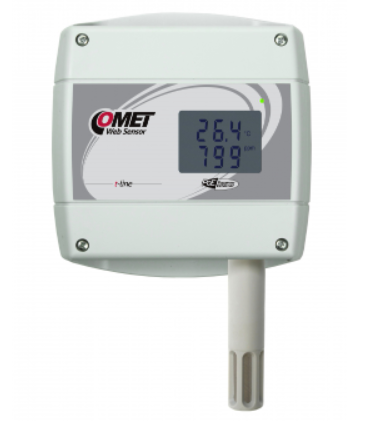

# Comet Tx6xx and Tx5xx Series

<p align="center">
  
</p>

A Thinger.io plugin that seamlessly ingests SOAP XML data coming from Comet Tx5xx / Tx6xx dataloggers (temperature, humidity, CO₂ and/or pressure) and converts it into structured JSON records stored in a Data Bucket. The plugin provides an HTTPS endpoint, automatic device provisioning, data parsing in Node JS, and ready-to-use dashboards and alarms.

## Thinger.io and Plugin Name Integration

Integrating Comet dataloggers with Thinger.io turns raw sensor frames into actionable IoT data:

1. Zero‑touch onboarding – every new logger becomes a Thinger Device the first time it reports.

2. Unified data model – the Node JS parser normalises both CO₂‑capable and Pressure‑only frames, distinguishing between
firmware v1.0 & v1.1 XML versions.

3. Dashboards & Tools out‑of‑the‑box – visualise temperature, humidity, CO₂, pressure and alarm LEDs.

4. Fully serverless inside Thinger.io – no extra VPS or middleware required; everything runs in the Node‑RED and File Storage plugins shipped with the platform.

## Requirements

| Component | Minimum version | Notes |
|-----------|-----------------|-------|
| Thinger.io instance | 6.5.4-developer or newer | Must support **Plugins** and **Proxy Forwarders** |
| Node-RED plugin | latest | Enabled in Thinger.io and reachable internally on port 1880 |
| `node-red-contrib-http-custom-port` | latest | Allows HTTP listeners on custom ports (4444 by default) |
| Comet Tx5xx / Tx6xx logger | any SOAP-capable firmware | Device must be configured to POST data to `http://your-host:4444/` |
| External TCP/UDP reachability | Port **4444** (or chosen) | Forwarded to Node-RED via Thinger **Proxy Forwarder** |

## Get Started

### Installation

1. **Create a Proxy Forwarder** — In *Plugins → Proxy Forwarders* add a rule:  
   * **External Port**: `4444`  
   * **Internal Port**: `4444`  
   * **Target Plugin**: `Node-RED`
2. **Enable Node-RED** — If not already running, start the Node-RED plugin.
3. **Install extra palette** — Inside Node-RED click **Hamburger → Manage Palette → Install** and add `node-red-contrib-http-custom-port`.
4. **Import the flow** — Create a new workspace, click **Import**, paste the following *Data Forwarder* JSON: 

```json

[
  {
    "id": "14cbd731707c799d",
    "type": "tab",
    "label": "Data Forwarder",
    "disabled": false,
    "info": "",
    "env": []
  },
  {
    "id": "07593d6ab65d04d0",
    "type": "function",
    "z": "14cbd731707c799d",
    "name": "URL getter",
    "func": "let xml = (msg.payload || \"\").toString('utf8').trim();\n\nlet user = env.get(\"THINGER_USER\");\nlet host = env.get(\"THINGER_HOST\");\n\n// In case the Product or Resource Name were to be\n// modified, the following URL would have to be updated\n// accordingly\nlet url = \"https://\" + host + \"/v1/users/\" + user + \"/products/comet_tx5xx_tx6xx/resources/comet_data_resource\"\n\nmsg.payload = xml;\nmsg.url = url;\n\nreturn msg;\n",
    "outputs": 1,
    "timeout": 0,
    "noerr": 0,
    "initialize": "",
    "finalize": "",
    "libs": [],
    "x": 610,
    "y": 160,
    "wires": [["9b19493f4a133187", "f1770c1b8556b09b"]]
  },
  {
    "id": "f1770c1b8556b09b",
    "type": "http response",
    "z": "14cbd731707c799d",
    "name": "OK",
    "statusCode": "200",
    "headers": {},
    "x": 770,
    "y": 200,
    "wires": []
  },
  {
    "id": "c8355bc6f75b8ff6",
    "type": "node-red-contrib-http-custom-port",
    "z": "14cbd731707c799d",
    "name": "HTTP request",
    "url": "/",
    "method": "post",
    "upload": false,
    "swaggerDoc": "",
    "port": "4444",
    "x": 430,
    "y": 160,
    "wires": [["07593d6ab65d04d0"]]
  },
  {
    "id": "9b19493f4a133187",
    "type": "http request",
    "z": "14cbd731707c799d",
    "name": "",
    "method": "POST",
    "ret": "txt",
    "paytoqs": "ignore",
    "url": "",
    "tls": "",
    "persist": false,
    "proxy": "",
    "insecureHTTPParser": false,
    "authType": "bearer",
    "senderr": false,
    "headers": [
      {
        "keyType": "other",
        "keyValue": "application",
        "valueType": "other",
        "valueValue": "xml"
      }
    ],
    "x": 790,
    "y": 120,
    "wires": [[]]
  }
]

```

5. Finally, enter the node "http-request", select "Use authentication", select "Bearer authentication" and paste `${THINGER_TOKEN_NODE_RED_PLUGIN}` in Token. Then press "Done"
6. Press "Deploy" to start Node RED instance.

### Usage

1. Configure each Comet logger's **SOAP destination** to `https://<your-host>/4444/`.
2. Node-RED receives the POST request, forwards raw XML to the Product API.
3. The Node JS script parses and normalises the frame; Thinger auto-provisions (device-id = `comet_<passKey>` by default) and writes data to the bucket.
4. Build dashboards or set alarms in the usual Thinger UI.

## Additional Resources

- [Documentation](https://www.cometsystem.es/productos/reg-t6640)
