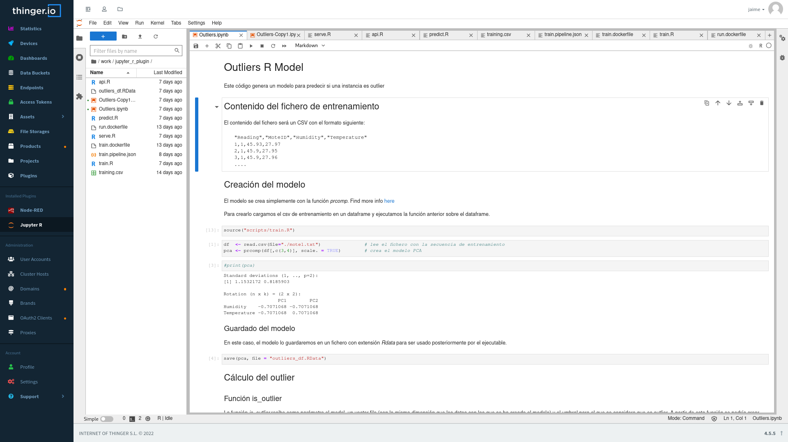

# Jupyter R

  

Thinger.io plugin for running Jupyter R version on the Cloud, integrating with Thinger.io file storages.

## Features

- Have your Notebook where your data is, providing a unified management and data access
- Delegate the execution of the code and algorithms to a cloud environment
- Develop in a stable environment

## Technical Features

This version integrates the following technology:

- R interpreter
- Python3 Runtime
- git
- TeX Live for document conversion.

More details in what this plugins includes can be found [here](https://jupyter-docker-stacks.readthedocs.io/en/latest/using/selecting.html#jupyter-r-notebook)

## Screenshots

