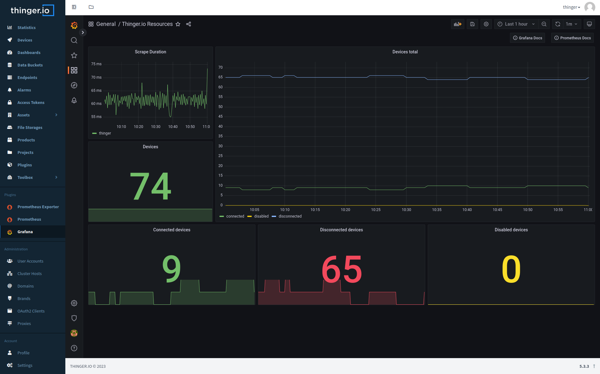

# Prometheus

  

Prometheus is an open-source monitoring system and time series database that allows you to collect and store metrics about your infrastructure and applications, and provides a powerful query language called PromQL that you can use to analyze and graph these metrics.

Prometheus also provides a range of other features, including alerting, graphing, and visualization.

One of the key features of Prometheus is its ability to scrape data from targets using a simple HTTP-based protocol. This means that you can easily configure Prometheus to monitor your infrastructure, in this case Thinger.io.

By utilizing both the [Prometheus Exporter Plugin](https://marketplace.thinger.io/plugins/prometheus_exporter/) and the Prometheus Server Plugin, you gain the ability to assess the status of Thinger.io and its resources through database queries. Moreover, this integration extends its functionality to enable monitoring of external systems.

## Get Started

When installing the Prometheus Plugin, a new file storage is created called 'Prometheus Settings'. This file storage contains a template of the configuration in order to scrape the [Prometheus Exporter Plugin](https://marketplace.thinger.io/plugins/prometheus-exporter) endpoint.

In order for the connection to take place, edit the file by introducing your details and restart the plugin.

This file can also be used to configure external systems scraping.

> [!NOTE]
> Check out also the [Alertmanager plugin](https://marketplace.thinger.io/plugins/alertmanager)

## Integration with Grafana

Grafana provides native support for Prometheus, therefore, we can configure a connection between the two plugins.

> [!NOTE]
> Refer to the [Grafana plugin page](https://marketplace.thinger.io/plugins/grafana) if you need more details on how to get started

Once grafana in installed and logged in, you may go to 'Settings'->'Data sources'. Click on `Add data source` and click on 'Prometheus'.
The data to configure the Prometheus as data source you'll need:
- URL: http://<thinger\_user>-prometheus:9090/users/<thinger\_user>/plugins/prometheus

And thats it, you may start now creating dashboard in grafana with prometheus as the backend.

## Official Documentation

The Prometheus documentation is available at [prometheus.io/docs](https://prometheus.io/docs/introduction/overview/).

More details regarding the configuration of Prometheus at [this link](https://prometheus.io/docs/prometheus/latest/configuration/configuration/).

> [!NOTE]
> Any configuration change in `prometheus.yml` requires a restart of the Prometheus plugin.
