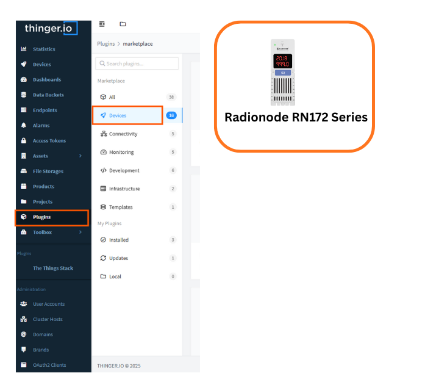

RN172

# Radionode - RN172Plus Series

The **RN172WCD** by RADIONODE is a versatile Wi-Fi sensor data transmitter designed for real-time environmental monitoring in industrial, commercial, and laboratory settings.

It supports a wide range of UA series sensors, including gas detectors (CO₂, O₂, NH₃, etc.), thermal sensors (PT100, thermocouples), and analog transmitters (4–20 mA, 0–1 V), enabling flexible deployment across various applications.

With Wi-Fi (IEEE 802.11 b/g), MODBUS TCP, and HTTP/HTTPS connectivity, the device seamlessly transmits data to cloud platforms like Radionode365, local servers, or PLCs for centralized monitoring. Additional features include a built-in buzzer, dual-color LED indicators, and a 4-digit display for real-time readings and alerts.

The RN172WCD also supports remote configuration via Telnet and offers robust alarm functionalities, including SMS and voice call notifications, making it an ideal solution for safety-critical environments such as gas monitoring, HVAC systems, and industrial automation.

---

## Thinger.io and Plugin Name Integration

This product enables automatic device provisioning and data visualization for Radionode RN172plus sensors through Thinger.io's IoT platform.

## Requirements

To continue with this guide we will need the following:

* RN172plus series
* RN172WCD user manual

## Get Started

### Installation

Look for the devices tab and click on the RN172 device as shown in the figure below.

 

### Configuration

The Product is already preconfigured, check that the auto provision prefix matches the plugin in Thinger.io.

### **Usage**

Once configured, the RN320-BTH data becomes available as live resources within Thinger.io. Users can:

* Instantly view measurements through dashboards, including real-time temperature, humidity, and battery status.
* Store time-series data in buckets for historical analysis.
* Create alerts for thresholds or anomalies.
* Send downlink commands to the device (change transmission interval, retrieve stored records, request device configuration).
* Integrate measurements with automation workflows and external services.
* Export data to CSV for analysis in external tools.

## Additional Resources

Radionode RN172Plus resources can be found at

* [Radionode RN172Series Product Page](https://en.radionode365.com/kr/product/product_view.php?idx=111&part_idx=1)
* [Thinger.io LoRaWAN Documentation](https://docs.thinger.io/lpwan)
* [Thinger.io Dashboards Guide](https://docs.thinger.io/dashboards)
* [Thinger.io Community Forum](https://community.thinger.io/)