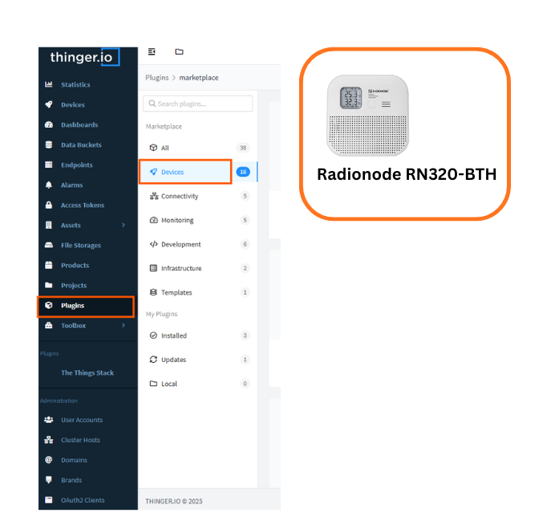

# Radionode - RN320-BTH

The Radionode RN320 series is a robust, battery-operated wireless environmental sensor, professionally engineered for durability and 
extreme longevity, boasting an unbelievable 10-year battery life (RN320-BTH model with 17,000mAh) facilitated by LoRaWAN technology 
for easy, wide-range network setup. This specific RN320-BTH model excels with an embedded high-accuracy temperature and humidity sensor, 
critical data protection via a retransmission function that prevents sample drops, and permanent local storage on a microSD card.

---

### Features of RN-320 BTH Device

*   Long Range Wireless / LoraWAN ®
*   High Accuracy Temperature & Humidity Sensor
*   E-Paper Display
*   Loud Buzzer 97dBA
*   3 Color LED Indicator (Best, Moderate, Bad)
*   Long Battery Life (17000mAh)
*   MicroSD Card supported
*   Easy Installation with Magnet and Wall Bracket

## Thinger.io and Plugin Name Integration

This product enables automatic device provisioning and data visualization for Radionode RN320-BTH sensors through Thinger.io's IoT platform.

## Requirements

A LoRaWAN server is required to communicate the Radionode sensors into Thinger.io, some options are:

*   The Things Stack
*   LORIOT
*   ChirpStack

## Get Started

### **Configuration**

1. Provide device identifiers and communication parameters.
2. Configure LoRaWAN options as applicable.
3. Save and enable the plugin.

### Installation

Look for the plugin in the [Thinger.io Plugin Marketplace](https://acme.thinger.io/console/plugins/marketplace) and install it in your Thinger.io instance.
 Once the plugin is installed a new Product will be created for this device.

 

 ### Configuration

The Product is already preconfigured, check that the auto provision prefix matches the one selected in your LoRaWAN server plugin in Thinger.io, or change it to your desire.

### **Usage**

Once configured, the RN320-BTH data becomes available as live resources within Thinger.io. Users can:

* Instantly view measurements through dashboards, including real-time temperature, humidity, and battery status.
* Store time-series data in buckets for historical analysis.
* Create alerts for thresholds or anomalies.
* Send downlink commands to the device (change transmission interval, retrieve stored records, request device configuration).
* Integrate measurements with automation workflows and external services.
* Export data to CSV for analysis in external tools.

## Additional Resources

Radionode RN320-BTH resources can be found at

* [Radionode RN320 Product Page](https://en.radionode365.com/kr/product/product_view.php?idx=102&part_idx=1)
* [Thinger.io LoRaWAN Documentation](https://docs.thinger.io/lpwan)
* [Thinger.io Dashboards Guide](https://docs.thinger.io/dashboards)
* [Thinger.io Community Forum](https://community.thinger.io/)

