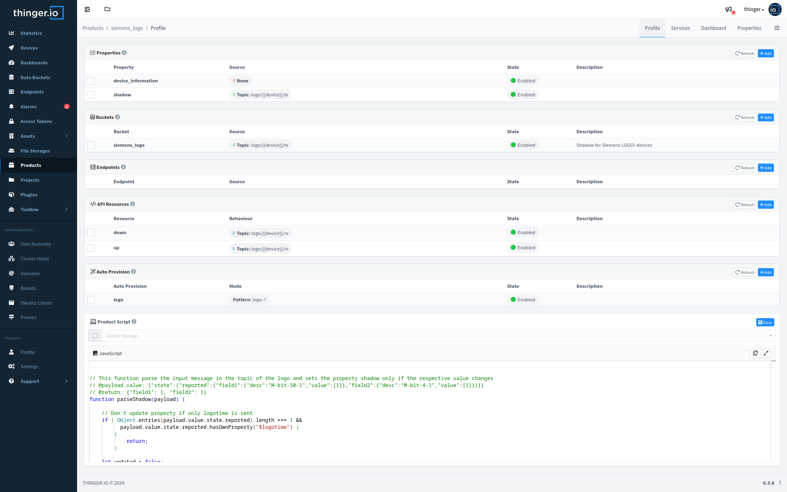
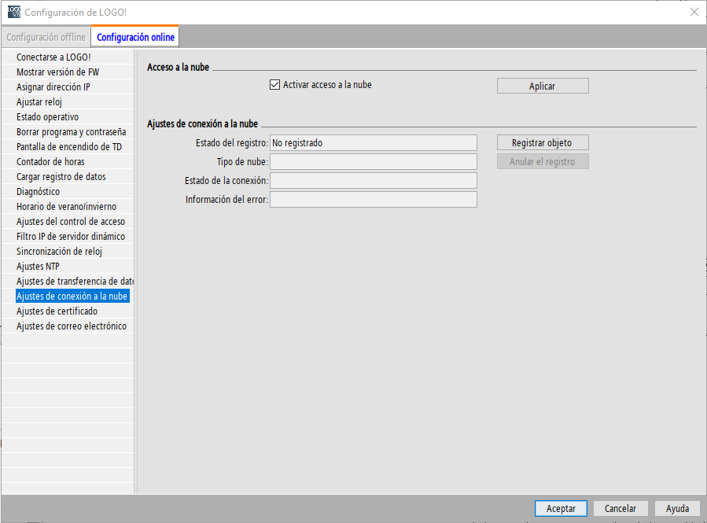
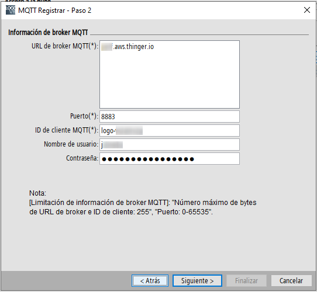
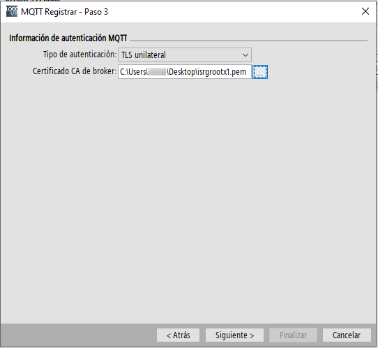
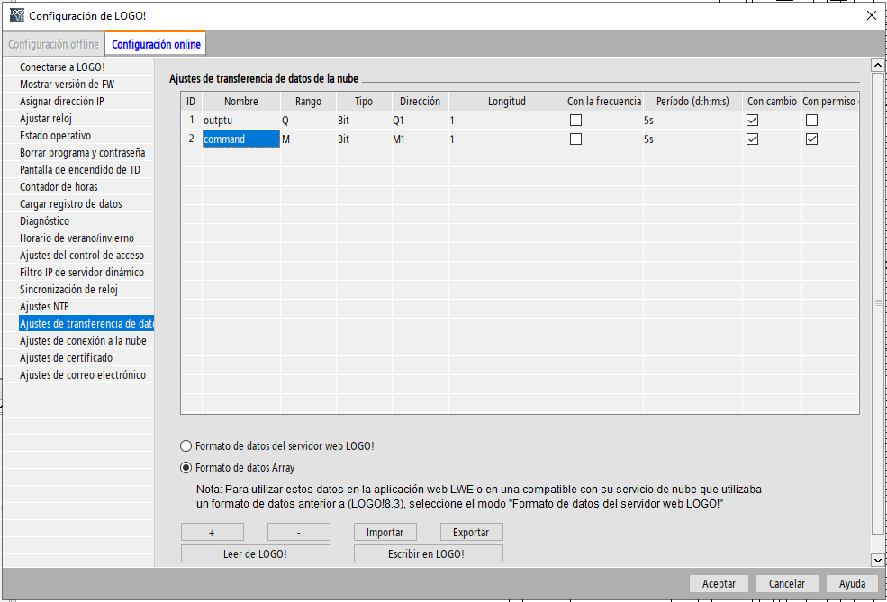

# Siemens LOGO!

  

Siemens LOGO! is a highly versatile logic module known for its simplicity, flexibility, and reliability. Widely used in industrial automation, building control, and various other applications, Siemens LOGO! allows for easy implementation of control tasks without requiring extensive programming knowledge.

## Thinger.io and Siemens LOGO! integration

Integrating Siemens LOGO! with Thinger.io can significantly enhance its capabilities by enabling remote monitoring, control, and automation of LOGO!-based systems. This integration empowers users to access, visualize, and manage LOGO! data remotely through Thinger.io platform, enabling real-time monitoring, data analysis, and automation of LOGO!-based applications.

> [!NOTE] Siemens LOGO! minimum requirements
> Siemens LOGO! 8.4 or later is required to use this plugin, as it supports open MQTT communication. [More info](https://support.industry.siemens.com/cs/document/109826554/sales-release-for-logo!-8-4-basic-devices-and-logo!-soft-comfort-v8-4-?dti=0)
> Siemens LOGO! Soft Comfort V8.4 or later is required to configure the MQTT communication. [More info](https://support.industry.siemens.com/cs/document/109826553/download-and-installation-instructions-for-logo!-soft-comfort-upgrade-v8-4?dti=0)

The plugin provides a first step to be able to integrate a fleet of Siemens LOGO! controllers, while allowing the ad-hoc configuration that best suits the user's needs.

It provides the following settings:

- A **device_information** property, that will be used to set the device information manually (firmware version, serial number, etc).
- A **shadow** property, that will be used to store the current state of the device.
- A **siemens_logo** data bucket, that will be used to store the data sent by the Siemens LOGO! controller.
- An **up** and **down** device resources, to control the Siemens LOGO! controller.
- An **autoprovision** rule, that will be used to create the device in the Thinger.io platform automatically.
- Basic **product functions** to parse the shadow of the device and handling sending commands to the Siemens LOGO! controller.
- A preconfigured **dashboard** to visualize relevant data of each Siemens LOGO! controller. 

## Get Started

After installing the Siemens LOGO! Plugin, it is time to configure the device to connect to Thinger.io platform. The following steps will guide you through the process:

#### Connect Siemens LOGO! to the Internet

Ensure that your Siemens LOGO! device is connected to the Internet, either through an Ethernet connection or a compatible IoT module.

#### Set the Device Time

Set the time and date on the Siemens LOGO! through the menu `Tools -> Transfer -> Set Time...`.

#### Configure MQTT Communication

Configure the Siemens LOGO! device to communicate with Thinger.io platform using MQTT protocol. You will need to provide the MQTT broker address, port, username, and password. Go to the menu option `Tools -> Transfer -> Cloud settings -> Cloud connection settings` and configure the settings as shown below:

  1. In the new dialog that appears on screen, check the `Active Cloud Access`. Then, click on `Register object`.
  

  2. Select the `Type of cloud` as `MQTT` and click on `Next`.
  

  3. Now set the broker URL, port, device id, username, and device password.
    * Broker URL: domain name of the instance of Thinger.io. If you use the Community Console, the URL should be `backend.thinger.io`. If you use a private instance use your own URL.
    * Port: 8883 is recommended over 1883.
    * Device ID: Identifier that we will give to the device in the Thinger.io platform and which must be unique. The current autoprovision rule is to start with 'logo-', which can be followed by the serial number of the device for example.
    * Username: Username of the Thinger.io platform that will own the device resource in the system.
    * Device Password: Password of the device the Thinger.io platform will use to authenticate the device. It will be configured on the platform on autoprovision.
  

  4. In this next step, we will select for `Authenticacion Type` the option `Unilateral TLS`. The certificate CA de broker uses can be download from this [link](https://letsencrypt.org/certificates/), specifically the pem certificate `ISRG Root X1`, valid until 2023-06-04.
  
  

  5. In the next dialog screen we will configure the MQTT topics in which the Siemens LOGO! publishes and is subscribed.
    * Publish topic: topic where the LOGO! will send data to be read form the Thinger.io Cloud platform. We suggest the following structure: `logo/<id of the device>/tx`
    * Subscribe to topic: topic where the LOGO! will receive data sent by the Thinger.io Cloud platform. We suggest the following structure: `logo/<id of the device>/rx`
  

  6. After a few seconds, the device will autoprovision itself on Thinger.io Platform. You can check the device status on the Thinger.io Console.
  
  

### Configure Data Exchange

Configure the data registers in the Siemens LOGO! device that you want to exchange with Thinger.io platform.

  * In the following image, the two registers will be sent to the publish topic (`logo/<id of the device>/tx`) configured in the previous step, when their value changes.
  * To send data from the platform to the controller, the register must be set with `write permissions`. In this case the register M1.

By following all these steps the plugin will be fully configured, and it is time to begin the configuration of the Product for your own project requirements.

### Remote Configuration

In order to configure the Siemens LOGO! remotely, a Thinger.io [Linux Client](https://docs.thinger.io/linux) is required to be installed in the same LAN as the device. By leveraging the [proxies features](https://docs.thinger.io/business-features/proxies),
it is possible to open a remote tunnel from the Siemens Soft Comfort software to the Siemens LOGO! through the Thinger.io platform.

If there are any questions regarding this configuration, we'd be happy to help you. Please reach out to us through the [Thinger.io Community](https://community.thinger.io/) or the [Thinger.io Support](https://thinger.io/support/).

## Additional Resources

There are several resources available with both the Siemens LOGO! and Thinger.io Platform that can help you get started with your project:

* [Siemens LOGO! System Manual](https://support.industry.siemens.com/cs/document/109826499/logo!?dti=0)
* [Siemens LOGO! Support Forum](https://support.industry.siemens.com/forum/es/en/conf/65/)
* [Thinger.io Products Documentation](https://docs.thinger.io/business-features/products)
